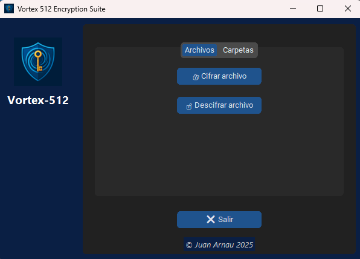

# VORTEX-512 🚀

**VORTEX-512** es una suite de cifrado avanzada diseñada para proteger archivos y carpetas mediante algoritmos personalizados de alta seguridad. Desarrollada para entornos donde la confidencialidad y la integridad de los datos son críticas.

---

## 🧩 ¿Qué hace VORTEX-512?

- 🔒 **Cifra archivos individuales** con algoritmos propios
- 📁 **Cifra carpetas completas**, incluyendo subdirectorios
- 🔓 **Descifra contenido** de forma rápida y segura
- 🧠 Utiliza algoritmos desarrollados específicamente para esta suite
- 🖥️ Interfaz gráfica intuitiva para usuarios técnicos y no técnicos

---

## 🛠️ Tecnologías utilizadas

- **Python 3.11**
- **PyQt** para la interfaz gráfica
- Algoritmos de cifrado desarrollados desde cero
- Soporte para estructuras de archivos complejas

## 🔐 Algoritmos de Cifrado Utilizados

**VORTEX-512** emplea una combinación de algoritmos modernos y seguros para garantizar la confidencialidad e integridad de los datos:
 
🛡️ Seguridad aplicada
- Cifrado simétrico fuerte: AES-128 en modo CBC con IV aleatorio
- Autenticación de datos: HMAC incluido en cada token Fernet
- Protección contra ataques de diccionario: PBKDF2 con 100.000 iteraciones
- Separación de claves: Cada contraseña genera una clave única
- Evita doble cifrado: Archivos .encrypted no se vuelven a cifrar

## 📦 Aplicaciones del cifrado

- Cifrado y descifrado de archivos individuales
- Cifrado de carpetas completas con recorrido recursivo
- Validación de contraseña doble para cifrado
- Interfaz gráfica intuitiva con CustomTkinte

---

## 🔐 Autenticación de Datos con HMAC-SHA256
VORTEX-512 ahora incluye autenticación criptográfica para garantizar la integridad de los datos cifrados. Esto significa que cualquier manipulación o corrupción de los archivos cifrados será detectada automáticamente durante el descifrado.
¿Cómo funciona?
- Se utiliza HMAC-SHA256 para generar un código de autenticación único para cada archivo cifrado.
- Este código se añade al final del archivo cifrado.
- Durante el descifrado, se recalcula el HMAC y se compara con el original.
- Si los datos han sido alterados, el sistema lanza un error y bloquea el descifrado.
Beneficios
- 🛡️ Protección contra manipulación maliciosa o accidental
- ✅ Verificación automática de integridad
- 🔒 Seguridad reforzada sin comprometer rendimiento
Aplicación
- Archivos individuales: el cifrado y descifrado ahora usan vortex_encrypt y vortex_decrypt, que incluyen autenticación.
- Carpetas completas: las funciones encrypt_folder y decrypt_folder han sido actualizadas para aplicar autenticación a cada archivo .vortex.
Ejemplo de uso
```bash
from vortex_core import vortex_cipher

# Cifrar
encrypted = vortex_cipher.vortex_encrypt(b"mensaje secreto", key)

# Descifrar (verifica autenticidad)
decrypted = vortex_cipher.vortex_decrypt(encrypted, key)
```

## 🧪 Pruebas unitarias
VORTEX-512 incluye una batería de pruebas automatizadas para garantizar la fiabilidad del cifrado, la autenticación y la reversibilidad de los datos. Las pruebas están escritas con unittest y cubren tanto archivos individuales como carpetas completas.
🔍 Cobertura de pruebas
|  |  |  | 
| test_encrypt_decrypt |  |  | 
| test_authentication_failure |  |  | 
| test_padding_unpadding |  |  | 
| test_sbox_reversibility |  |  | 
| test_encrypt_decrypt_folder |  |  | 
| test_authentication_failure_folder |  |  | 


## 📂 Ubicación
Los tests se encuentran en la carpeta vortex_tests/ y pueden ejecutarse con:
```bash
python vortex_tests/test_vortex_cipher.py
python vortex_tests/test_folder_crypto.py
```

También puedes usar pytest para ejecutar todos los tests:
```bash
pytest vortex_tests/
```

---

## 📌 Requisitos
- Python 3.10+
- Paquetes: unittest, cryptography, customtkinter, Pillow

---

## 📌 Recomendaciones

- Usar contraseñas largas y únicas
- No compartir contraseñas por canales inseguros

---

## 📥 Descargas
La última versión compilada está disponible en la página de releases. Incluye el instalador VORTEX-512-Setup.exe y los componentes necesarios para ejecución en Windows.

⚠️ Nota: Los binarios (.exe y .dll) no están incluidos en el repositorio. Puedes descargarlos desde la sección de Releases.

---

## 📸 Capturas de pantalla




---

## 🧪 Tests
pytest tests/

---

## 🌐 Página del proyecto
Puedes visitar la web oficial del proyecto haciendo clic en el logo:

[](https://juanarnau.github.io/VORTEX-512)

---

## 📦 Instalación

```bash
git clone https://github.com/juanarnau/VORTEX-512.git
cd VORTEX-512
pip install -r requirements.txt
python main.py
```
---

## 👨‍💻 Autor
Juan Arnau
📍 Sueca, Comunitat Valenciana

---

## 📄 Licencia
Este proyecto está protegido por una licencia de uso restringido.  
Queda prohibido el uso comercial, la distribución o modificación sin autorización expresa del autor.

Consulta el archivo [`LICENSE`](LICENSE) para leer los términos completos.

Para colaboraciones o licencias comerciales, contacta con: juan.arnau@outlook.es

---

## 🤝 Colaboraciones

Se aceptan contribuciones al proyecto VORTEX-512 bajo las siguientes condiciones:

- Toda aportación será revisada y aprobada por el autor antes de su integración.
- Las contribuciones no implican cesión de derechos ni propiedad intelectual sobre el proyecto principal.
- El autor se reserva el derecho de modificar, rechazar o adaptar cualquier propuesta.
- Los colaboradores no podrán reutilizar el código del proyecto en otros desarrollos sin autorización expresa.

Al enviar una contribución, el desarrollador acepta estas condiciones y reconoce que su participación no otorga derechos de explotación ni uso comercial del software.

¡Las contribuciones son bienvenidas! Puedes abrir issues, enviar pull requests o proponer mejoras en la documentación.

Para propuestas de colaboración formal, contactar a: juan.arnau@outlook.es